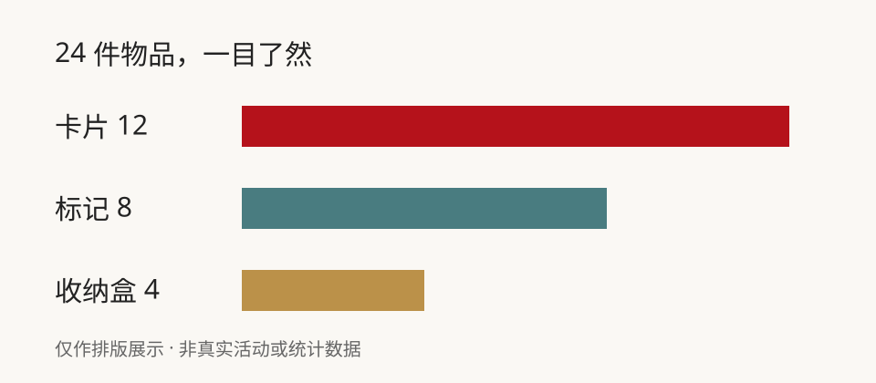

% title: 周末桌游体验
% subtitle: 主题展示 · 场景、数量与安排均为虚构
% author: 示例作者
% institution: 虚构活动示例
% date: 演示日期
% footer: 仅作模板演示 · 不对应真实个人或活动
% outline: false
% transition: fade
% end: 下一局，再见

--- 一张桌子，就能开始

::: note 今天的小目标
选一个规则简单的游戏，让第一次参加的人也能轻松加入。
:::

> notes: 本文是从零编写的虚构展示稿，不改写任何个人工作、论文或研究材料。

--- 两种玩法，两种节奏

::: example 合作闯关
一起讨论、共享线索，把共同完成任务作为目标。
:::

||

::: example 轻松对战
轮流行动、快速反馈，每局结束后交换座位。
:::

--- 开场只需要三个步骤

- 选一个游戏，摆好卡片。
- 用一轮示范解释规则。
- 开始体验，随时欢迎提问。

--- 用三种颜色整理物品

--- 一个简单的总数

$$
12 + 8 + 4 = 24
$$

所有数字仅用于演示公式与排版，不是采购建议或实测记录。

--- 结束前，留下一句反馈

::: note 记住一个开心的瞬间
哪条规则最容易理解？下次想尝试哪一种玩法？
:::

> notes: 主题只改变视觉风格，不应该把演示材料变成真实人物或真实工作的替身。
