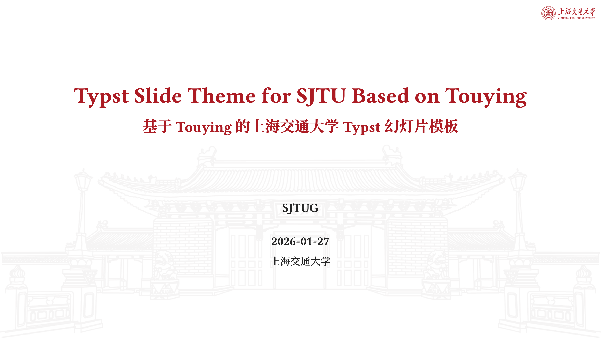

% title: 二类长度函数及解个数判据
% subtitle: 纯文本写稿示例
% author: 郑雪
% footer: 上海交通大学
% transition: fade

# 研究背景与模型

## 模型建立

--- 控制方程 [2] [0.45, 0.55]

- 从演化方程出发
- 建立长度函数
- 使用 **粗体**、*强调* 和 ==标记==

$$ {#burgers}
u_t + u u_x = \nu u_{xx} + f(x,t)
$$

--- 主要结论

::: theorem 解个数判据
由 @eq:burgers 可知，粘性项会影响解的正则性。
:::

这里是普通段落。直接写行内公式 $E = mc^2$ 即可。

$$
E = mc^2 \pause{2}{+ \int_0^1 x^2\,dx}
$$

--- 飞移动画[2]

### 移动判据[only=1][move=judge][fade]
::: theorem 判据
第 1 步，这个判据位于左栏。
:::

### 移动判据[step=2][move=judge][fade]
::: theorem 判据
第 2 步，同一个判据飞到右栏。
:::

--- 三栏对比[3][0.2,0.5,0.3][transition=rise]

||[1][1]

### 输入信息[slide-right]
::: definition 输入
初值与边界条件。
:::

|||

第一栏还可以继续放其他说明。

||[2][0.62,0.38]

### 核心结论[zoom]
#### 原始判据[1-2]
::: theorem 核心判据
中间栏使用更大的宽度。
:::

#### 化简判据[3-4]
::: theorem 化简结果
同一内容块中的前后内容会在固定位置替换。
:::

### 补充示例[blur]
::: example 补充
这个示例仍然位于第二栏。
:::

||[1][1]

### 最终输出[slide-left]
::: note 输出
解的个数。
:::

#v(1em)

这里使用 `#v(1em)` 留出了一点手动间距。

# 数值例子

## 图片与代码

--- 结果展示 [2]

{#fig:sjtu-thumb}

正文中可以引用 @fig:sjtu-thumb，点击后按 R 返回。

```text
这里可以放代码、伪代码或实验数据。
过长内容会在卡片内部滚动。
```

> notes: 这里是演讲者备注，按 N 查看。
